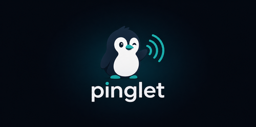

<p align="center">
  
</p>

<p align="center"><strong>Anonymous runtime analytics for npm packages.</strong><br>Real usage — not download noise.</p>

<p align="center">
  
  
  
  
</p>

<p align="center">
  <a href="https://youtu.be/JJYARlg1wEU">
    
  </a>
</p>

---

## 🎯 The problem

**npm download counts are useless** for understanding if anyone actually uses your package.

They count CI installs. Mirror caches. Bots. `npm install` in pipelines that never execute your code. A package with 100k weekly downloads might have **zero** real users.

**pinglet** tells you the truth: who's running your package, how often, and which parts.

|  | npm downloads | pinglet |
|---|---|---|
| Someone actually ran my code? | ❌ | ✅ |
| How many active anonymous users? | ❌ | ✅ |
| Which commands/features? | ❌ | ✅ |
| Which versions still active? | ❌ | ✅ |
| CI or real person? | ❌ | ✅ |
| macOS, Linux, Windows? | ❌ | ✅ |

---

## ⚡ Quick Start (3 steps)

### 1. Deploy your server

**Railway** (easiest): push this repo → create project → add volume → done.  
Full guide: [`docs/deploy-railway.md`](docs/deploy-railway.md).

**Docker**: `docker build -t pinglet . && docker run -p 3456:3456 -e PINGLET_ADMIN_PASSWORD=... pinglet`

**Self-host**: `npx -p @black-knight.dev/pinglet pinglet-server`

### 2. Login once

```bash
npx pinglet login --url https://your-server.example.com --user admin
```

Stores a 30-day token — **not** your password.

### 3. Add 5 lines to your package

```bash
npm install @black-knight.dev/pinglet
```

```ts
import { Pinglet } from '@black-knight.dev/pinglet';

const analytics = new Pinglet({
  packageName: 'my-package',
  packageVersion: '1.0.0',
  endpoint: 'https://your-server.example.com/ping',
});

await analytics.track('run');
await analytics.track('command:build');
```

That's it. Your package now sends anonymous runtime pings.

---

## 📊 What you see

```bash
npx pinglet                   # quick overview
npx pinglet my-package        # detailed stats
```

```json
{
  "pkg": "my-package",
  "totalPings": 1420,
  "uniqueUsers": 312,
  "events":      { "run": 980, "command:build": 310 },
  "versions":    { "1.4.0": 900, "1.3.0": 520 },
  "platforms":   { "darwin": 800, "linux": 500, "win32": 120 },
  "ci":          { "true": 40, "false": 1380 },
  "days":        { "2026-06-03": 1420 }
}
```

### CLI cheat sheet

```bash
pinglet                         # status overview
pinglet <pkg>                   # stats for package
pinglet ls                      # list all tracked packages
pinglet show <pkg>              # same as pinglet <pkg>
pinglet snippet <pkg>           # print copy-paste SDK code
pinglet health                  # server health check
pinglet login --url <url>       # login once
pinglet logout                  # remove local login
```

---

## 🛡️ Privacy

| Collected | Not collected |
|---|---|
| Random hashed client id | Hardware id, hostname, username |
| Event name | File paths, source code, logs |
| Package name + version | Environment variables, secrets |
| Node.js version | User-generated content |
| Platform (darwin/linux/win32) | IP address |
| CI flag | Client timezone |

Full privacy model: [`docs/security.md`](docs/security.md).

### Telemetry model

pinglet uses the **industry-standard opt-out model** (like Next.js, VS Code, Homebrew):

- **Tracking is ON by default** at level 1 (basic: `run` events only)
- **No prompts during `npm install`** — no postinstall script
- **Documented in every README** — open source transparency
- **Inspect before sending**: `PINGLET_DEBUG=1` shows the JSON payload without transmitting
- **Opt out anytime**: `PINGLET_OPT_OUT=1`, `DO_NOT_TRACK=1`, `--no-telemetry`

For more detail: [`docs/telemetry.md`](docs/telemetry.md).

---

## 🌐 Server endpoints

| Method | Path | Auth | Description |
|---|---|---|---|
| `POST` | `/ping` | public | Receive a runtime event |
| `POST` | `/auth/login` | Basic Auth | Create 30-day admin token |
| `GET` | `/auth/check` | Bearer token | Verify saved login |
| `GET` | `/packages` | admin | List tracked packages |
| `GET` | `/stats?pkg=<name>` | admin | Aggregated analytics |
| `GET` | `/health` | public | Health check |

---

## 📦 Deployment

| Platform | Guide |
|---|---|
| **Railway** | [`docs/deploy-railway.md`](docs/deploy-railway.md) — step by step |
| **Docker** | `docker build -t pinglet .` — single command |
| **Fly.io** | `fly launch --dockerfile Dockerfile` |
| **Self-host** | `npx -p @black-knight.dev/pinglet pinglet-server` |
| **Overview** | [`docs/deployment.md`](docs/deployment.md) — all options |

All deployments need one env var: `PINGLET_ADMIN_PASSWORD`.

---

## 🔌 API

### `new Pinglet(options)`

| Option | Required | Description |
|---|---|---|
| `packageName` | ✅ | Your package name |
| `packageVersion` | ✅ | Current version |
| `endpoint` | ✅ | URL receiving `POST /ping` |
| `salt` | — | Stable salt for anonymous client id |
| `silent` | — | Suppress console output |
| `timeoutMs` | — | Network timeout (default 1500ms) |
| `ingestToken` | — | Write token for private endpoints |
| `meta` | — | Non-PII properties on every event |

### Methods

```ts
await analytics.init()         // prepare client
await analytics.track('event') // send event — never throws
analytics.optOut()             // persist disable
analytics.optIn()              // re-enable
analytics.isOptedOut           // current state
```

---

## 📄 Documentation

| Doc | Topic |
|---|---|
| [`deployment.md`](docs/deployment.md) | Deploy (Railway, Docker, Fly) |
| [`deploy-railway.md`](docs/deploy-railway.md) | Railway guide |
| [`security.md`](docs/security.md) | Privacy, GDPR, hardening |
| [`maintainer-guide.md`](docs/maintainer-guide.md) | Add pinglet to your package |
| [`agent-quickstart.md`](docs/agent-quickstart.md) | For AI agents |
| [`market-research.md`](docs/market-research.md) | Why pinglet |
| [`examples/basic-cli.mjs`](examples/basic-cli.mjs) | Working example |

---

## ✅ Best practices

- Add a visible `Telemetry` section to your README
- Events go low-cardinality: `command:build`, not raw input
- Never track: paths, source code, logs, stack traces, secrets
- Support `DO_NOT_TRACK=1` + `PINGLET_OPT_OUT` + `--no-telemetry`
- Offer `PINGLET_DEBUG=1` so users can inspect the payload before trusting
- Telemetry failures are always silent and non-blocking

---

## 📝 License

MIT
